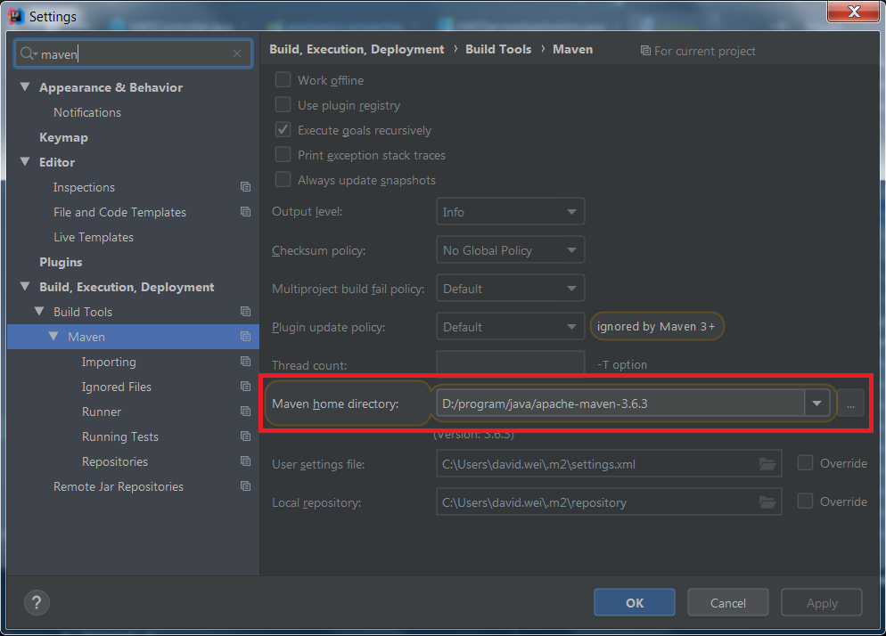
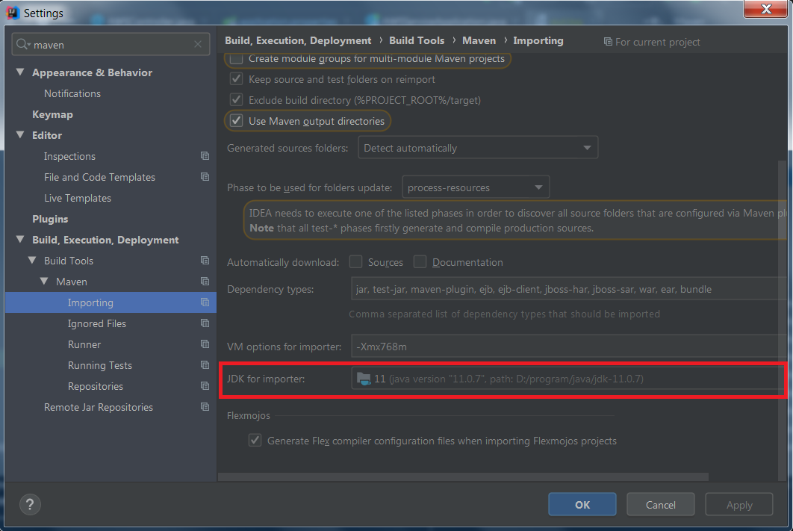

### maven for windows
#### extract
```text
extract java/apache-maven-3.6.3-bin.zip to D:\program\java\apache-maven-3.6.3
```
#### set environment variables
```text
MAVEN_HOME=D:\program\java\apache-maven-3.6.3
path=%MAVEN_HOME%\bin;
```

### maven idea setting
#### maven home directory

#### jdk for importer

