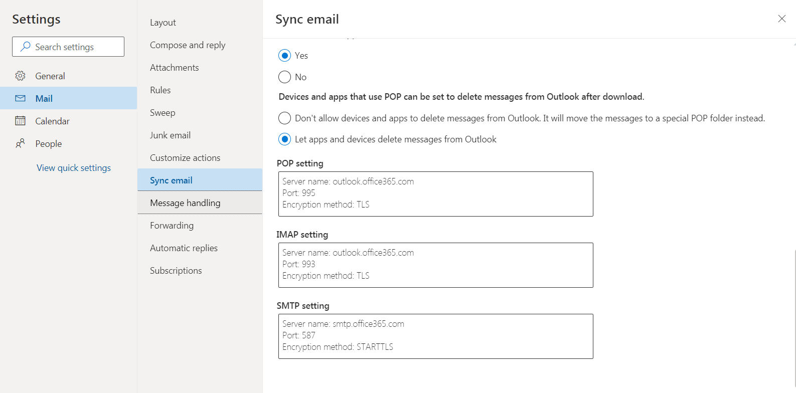
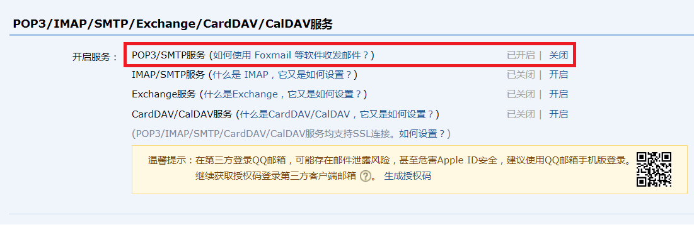

```xml
        <dependency>
            <groupId>org.springframework.boot</groupId>
            <artifactId>spring-boot-starter-mail</artifactId>
        </dependency>
```

```properties
#qq邮箱服务
spring.mail.host=smtp.qq.com
spring.mail.username=1020798180@qq.com
#该密码为qq邮箱开启POP3/SMTP之后生成的授权码
spring.mail.password=授权码


##outlook服务器
#spring.mail.host=smtp.office365.com
##用户名，注意这里需要@outlook.com后缀
#spring.mail.username=gwaysoft@outlook.com
##密码
#spring.mail.password=password
##stmp端口
#spring.mail.port=587
## 设置TLS认证
#spring.mail.properties.mail.smtp.starttls.required=true
```
```java
@Slf4j
@Service
@RequiredArgsConstructor
//@ConfigurationProperties(prefix = "qq")
public class QQMailService {

    private final JavaMailSender mailSender;
    @Value("${spring.mail.username}")
    private String from;


    /***
     * 邮箱发件服务
     * @param to  收件人邮件
     * @param subject  主题
     * @param content  内容
     */
    public void setMailSender(String to, String subject, String content) {
        SimpleMailMessage simpleMailMessage = new SimpleMailMessage();
        log.debug(from);
        simpleMailMessage.setFrom(from);
        simpleMailMessage.setTo(to);
        simpleMailMessage.setSubject(subject);
        simpleMailMessage.setText(content);
        try{
            mailSender.send(simpleMailMessage);
        }catch (Exception e){
            e.printStackTrace();
        }
    }
}
```






