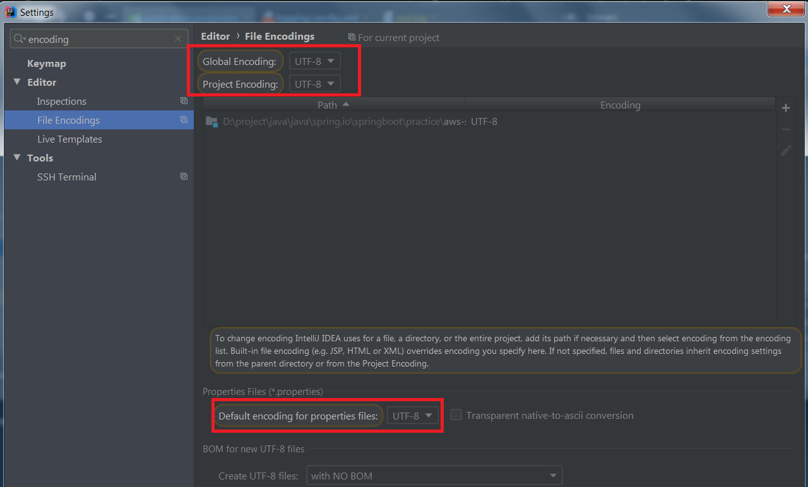

## plugins
#### lombok
```text
# setting -> plugins
# search lombok, if not install successfully, please install many times
# add dependency at pom.xml
```
```xml
        <dependency>
            <groupId>org.projectlombok</groupId>
            <artifactId>lombok</artifactId>
            <optional>true</optional>
            <scope>provided</scope>
        </dependency>
```

## keng
### project utp-8 setting
```shell script
# maven failure
D:\program\ideaIU-2019.1-jbr11.win\jre64\bin\java.exe -Dmaven.multiModuleProjectDirectory=D:\project\java\java\spring.io\springboot\practice\aws-service -Dmaven.home=D:\program\ideaIU-2019.1-jbr11.win\plugins\maven\lib\maven3 -Dclassworlds.conf=D:\program\ideaIU-2019.1-jbr11.win\plugins\maven\lib\maven3\bin\m2.conf -javaagent:D:\program\ideaIU-2019.1-jbr11.win\lib\idea_rt.jar=54892:D:\program\ideaIU-2019.1-jbr11.win\bin -Dfile.encoding=GBK -classpath D:\program\ideaIU-2019.1-jbr11.win\plugins\maven\lib\maven3\boot\plexus-classworlds-2.5.2.jar org.codehaus.classworlds.Launcher -Didea.version2019.1 package
[INFO] Scanning for projects...
[INFO]                                                                         
[INFO] ------------------------------------------------------------------------
[INFO] Building aws-service 1.0-SNAPSHOT
[INFO] ------------------------------------------------------------------------
[INFO] 
[INFO] --- maven-resources-plugin:3.2.0:resources (default-resources) @ aws-service ---
[INFO] Using 'UTF-8' encoding to copy filtered resources.
[INFO] Using 'UTF-8' encoding to copy filtered properties files.
[INFO] Copying 1 resource
[INFO] ------------------------------------------------------------------------
[INFO] BUILD FAILURE
[INFO] ------------------------------------------------------------------------
[INFO] Total time: 8.825 s
[INFO] Finished at: 2020-12-07T10:31:21+08:00
[INFO] Final Memory: 16M/60M
[INFO] ------------------------------------------------------------------------
[ERROR] Failed to execute goal org.apache.maven.plugins:maven-resources-plugin:3.2.0:resources (default-resources) on project aws-service: Input length = 1 -> [Help 1]
[ERROR] 
[ERROR] To see the full stack trace of the errors, re-run Maven with the -e switch.
[ERROR] Re-run Maven using the -X switch to enable full debug logging.
[ERROR] 
[ERROR] For more information about the errors and possible solutions, please read the following articles:
[ERROR] [Help 1] http://cwiki.apache.org/confluence/display/MAVEN/MojoExecutionException

Process finished with exit code 1
```

